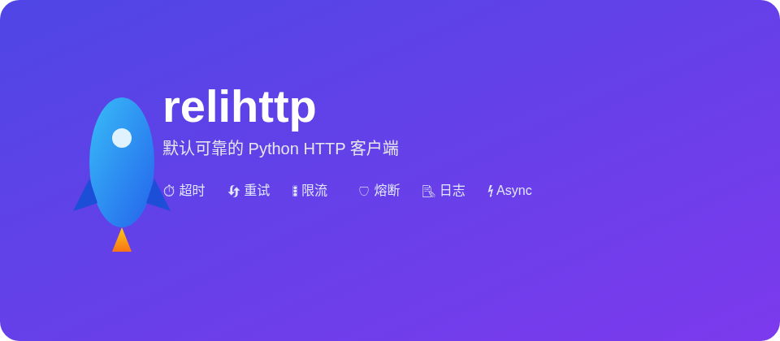

# relihttp

<div align="center">

**面向生产、默认可靠的 Python HTTP 客户端**

**简体中文** | [English](README.md)

[](https://www.python.org/downloads/)
[](https://docs.python-requests.org/)
[](LICENSE)
[](https://github.com/fzf54122/relihttp)

[📖 快速开始](#-快速开始) • [✨ 核心功能](#-核心功能) • [🧰 开发指南](#-使用-uv-进行开发) • [🏗️ 架构设计](#-架构设计) • [🔧 配置说明](#-配置说明) • [🤝 贡献指南](#-贡献指南)

</div>

## 🌟 为什么选择 relihttp？
<div align="center">
  
</div>

relihttp 是一个轻量级 HTTP 客户端，基于 `requests` 构建，默认内置可靠性特性。采用策略式（policy）设计，便于自定义和扩展各种行为。

<div align="center">

| 🎯 **默认可靠** | ⚡ **快速开发** | 🛡️ **高度可定制** | 📊 **结构化日志** |
|:---:|:---:|:---:|:---:|
| 内置超时、重试和限流 | 简洁 API + 合理默认值 | 策略式架构设计 | 标准日志 + 请求/响应详情 |

</div>

## 状态

Alpha (v0.1.0)，API 可能变化。

## ✨ 核心功能

### 🔧 可靠性控制
- **超时管理** - 全局和单次请求超时设置
- **智能重试** - 默认仅对安全方法重试
- **指数退避** - 带抖动算法，防止雪崩效应
- **网络弹性** - 网络异常和特定 HTTP 状态码自动重试
- **熔断器** - 错误突发时防止级联故障
- **幂等键** - 非幂等方法安全重试

### 📦 限流功能
- **令牌桶算法** - 平滑限流
- **灵活模式** - `sleep`（等待令牌）或 `raise`（快速失败）
- **客户端级配置** - 轻松适配不同端点需求

### 📝 日志与可观测性
- **结构化日志** - 标准 `logging` 模块集成
- **丰富上下文** - 请求 ID、方法、URL、状态码和时序信息
- **事件类型** - `http.request`、`http.response`、`http.error` 事件
- **追踪头注入** - 请求/链路 ID 端到端追踪

#### 使用示例
```python
import logging
from relihttp import AbstractClient, ClientTypeEnum

# 配置日志
logging.basicConfig(
    level=logging.INFO,
    format='%(asctime)s - %(name)s - %(levelname)s - %(message)s'
)

client = AbstractClient.create_client(
    ClientTypeEnum.SYNC,
    base_url="https://api.example.com",
    timeout=3.0,
    max_retries=3
)
response = client.get("/users")
```

#### 日志输出
```
2026-02-03 14:30:00 - relihttp - INFO - event=http.request request_id=abc123 method=GET url=https://api.example.com/users
2026-02-03 14:30:00 - relihttp - INFO - event=http.response request_id=abc123 status_code=200 elapsed_ms=150
```

结构化日志格式易于与 ELK、Loki 或 APM 等监控系统集成，提升问题定位效率和可观测性。

### 🏗️ 可扩展架构
- **策略式设计** - 轻松添加或替换行为
- **可插拔传输层** - 默认 `requests`，支持自定义
- **中间件钩子** - 请求前后和重试决策回调

### 🎨 开发者体验
- **熟悉的 API** - 基于 `requests` 接口
- **单次请求覆盖** - 为特定请求自定义配置
- **类型提示** - 完整 Python 类型注解支持
- **清晰文档** - 全面的指南和示例
- **AsyncIO 支持** - 异步客户端与传输（可选 `aiohttp`）

## 安装

```bash
pip install relihttp
```

## 🧰 使用 uv 进行开发

`uv` 是推荐的开发包管理器，提供更快的安装速度和更好的依赖管理。

### 安装 uv

```bash
# 安装 uv（如果尚未安装）
pip install uv
```

### 常用命令

```bash
# 创建虚拟环境
uv venv

# 激活虚拟环境
source .venv/bin/activate  # Linux/macOS
.venv\Scripts\activate     # Windows

# 安装依赖
uv install

# 安装包含开发依赖
uv install -e .[dev]

# 运行测试
uv run pytest

# 运行测试并生成覆盖率报告
uv run pytest --cov=relihttp

# 使用 ruff 格式化代码
uv run ruff format

# 使用 ruff 检查代码
uv run ruff check

# 使用 mypy 进行类型检查
uv run mypy

# 构建包
uv build

# 清理
uv clean
```

## 📦 打包与发布

### 本地打包

```bash
# 构建 sdist 与 wheel 输出到 dist/
uv build
```

### 发布到 PyPI

```bash
# 1) 在 PyPI 创建 API Token 并导出
export TWINE_USERNAME="__token__"
export TWINE_PASSWORD="pypi-***"

# 2) 上传
python -m pip install twine
twine upload dist/*
```

### 先发布到 TestPyPI（推荐）

```bash
export TWINE_USERNAME="__token__"
export TWINE_PASSWORD="pypi-***"

python -m pip install twine
twine upload --repository testpypi dist/*
```

## 🛠️ 技术栈

| 组件 | 技术选型 | 版本要求 |
|------|----------|----------|
| **核心 HTTP 客户端** | requests | 2.0+ |
| **Python 版本** | Python | 3.9+ |
| **日志系统** | 标准 `logging` 模块 | - |
| **架构设计** | 策略式中间件 | - |

## 🚀 快速开始

```python
from relihttp import AbstractClient, ClientTypeEnum

client = AbstractClient.create_client(
    ClientTypeEnum.SYNC,
    base_url="https://api.example.com",
    timeout=3.0,
    retry="safe",
    max_retries=3,
    rate_limit=100,
)

resp = client.get("/users")
print(resp.json())
```

单次请求覆盖参数：

```python
client.post("/pay", json={"amount": 10}, timeout=1.5, max_retries=1)
```

## 🎯 AbstractClient 使用

`AbstractClient` 提供了一个工厂方法，可以根据指定的模式创建同步或异步客户端：

```python
from relihttp import AbstractClient, ClientTypeEnum

# 创建同步客户端
sync_client = AbstractClient.create_client(
    ClientTypeEnum.SYNC,
    base_url="https://api.example.com",
    timeout=3.0,
    max_retries=3
)

# 创建异步客户端
async def main() -> None:
    async_client = AbstractClient.create_client(
        ClientTypeEnum.ASYNC,
        base_url="https://api.example.com",
        timeout=3.0,
        max_retries=3
    )
    async with async_client:
        resp = await async_client.get("/users")
        print(resp.text)

# 使用示例
sync_response = sync_client.get("/health")
print(sync_response.status_code)
```

## 🔧 配置说明

通过简单开关启用扩展能力：

```python
from relihttp import AbstractClient, ClientTypeEnum

client = AbstractClient.create_client(
    ClientTypeEnum.SYNC,
    base_url="https://api.example.com",
    circuit_breaker=True,
    idempotency=True,
    trace=True,
)
```

### 完整策略示例

```python
from relihttp import AbstractClient, ClientTypeEnum
from relihttp.policies.circuit import CircuitBreakerPolicy
from relihttp.policies.idempotency import IdempotencyPolicy
from relihttp.policies.tracing import TracingPolicy
from relihttp.policies.timeout import TimeoutPolicy
from relihttp.policies.retry import RetryPolicy
from relihttp.policies.logger import LoggingPolicy
from relihttp.policies.rate_limit import RateLimitPolicy

client = AbstractClient.create_client(
    ClientTypeEnum.SYNC,
    policies=[
        TimeoutPolicy(timeout=3.0),
        RetryPolicy(max_retries=3, retry="safe"),
        RateLimitPolicy(rate_limit=50, burst=100, mode="sleep"),
        CircuitBreakerPolicy(window_size=20, failure_ratio=0.5, min_requests=10),
        IdempotencyPolicy(),
        TracingPolicy(request_id_header="X-Request-ID", trace_id_header="X-Trace-ID"),
        LoggingPolicy(),
    ]
)
```

### 熔断器（进阶）

```python
from relihttp import AbstractClient, ClientTypeEnum
from relihttp.policies.circuit import CircuitBreakerPolicy
from relihttp.policies.timeout import TimeoutPolicy
from relihttp.policies.retry import RetryPolicy
from relihttp.policies.logger import LoggingPolicy

client = AbstractClient.create_client(
    ClientTypeEnum.SYNC,
    policies=[
        TimeoutPolicy(timeout=3.0),
        RetryPolicy(max_retries=3, retry="safe"),
        LoggingPolicy(),
        CircuitBreakerPolicy(failure_threshold=3, recovery_timeout=10.0),
    ]
)
```

### 幂等键（进阶）

```python
from relihttp import AbstractClient, ClientTypeEnum
from relihttp.policies.idempotency import IdempotencyPolicy
from relihttp.policies.timeout import TimeoutPolicy
from relihttp.policies.retry import RetryPolicy
from relihttp.policies.logger import LoggingPolicy

client = AbstractClient.create_client(
    ClientTypeEnum.SYNC,
    policies=[
        TimeoutPolicy(timeout=3.0),
        RetryPolicy(max_retries=3, retry="safe"),
        LoggingPolicy(),
        IdempotencyPolicy(header_name="Idempotency-Key"),
    ]
)
```

### 追踪与请求 ID（进阶）

```python
from relihttp import AbstractClient, ClientTypeEnum
from relihttp.policies.tracing import TracingPolicy
from relihttp.policies.timeout import TimeoutPolicy
from relihttp.policies.retry import RetryPolicy
from relihttp.policies.logger import LoggingPolicy

client = AbstractClient.create_client(
    ClientTypeEnum.SYNC,
    policies=[
        TimeoutPolicy(timeout=3.0),
        RetryPolicy(max_retries=3, retry="safe"),
        LoggingPolicy(),
        TracingPolicy(request_id_header="X-Request-ID", trace_id_header="X-Trace-ID"),
    ]
)
```

### 异步客户端（AsyncIO）

```python
 # 安装异步依赖：
 # pip install relihttp[async]
 
import asyncio
from relihttp import AbstractClient, ClientTypeEnum

async def main() -> None:
    client = AbstractClient.create_client(ClientTypeEnum.ASYNC)
    async with client:
        resp = await client.get("https://example.com")
        print(resp.status_code)

asyncio.run(main())
```

## 重试行为

默认 `retry="safe"` 仅对幂等方法重试：`GET`、`HEAD`、`OPTIONS`、`PUT`、`DELETE`。  
当出现 `requests` 的网络异常或 HTTP 状态码为 `500`、`502`、`503`、`504`、`429` 时触发重试。

`max_retries` 表示最大总尝试次数（包含首次请求）。

自定义策略示例：

```python
from relihttp import AbstractClient, ClientTypeEnum
from relihttp.policies.retry import RetryPolicy
from relihttp.policies.timeout import TimeoutPolicy
from relihttp.policies.logger import LoggingPolicy

client = AbstractClient.create_client(
    ClientTypeEnum.SYNC,
    policies=[
        TimeoutPolicy(timeout=2.0),
        RetryPolicy(max_retries=5, retry="all", retry_on_status=[500, 502, 503]),
        LoggingPolicy(),
    ]
)
```

## 限流

`rate_limit` 表示每秒令牌数。默认模式会阻塞等待令牌可用。  
切换为 `raise` 模式可快速失败，抛出 `RateLimitedError`。

```python
from relihttp import AbstractClient, ClientTypeEnum
from relihttp.policies.rate_limit import RateLimitPolicy
from relihttp.policies.timeout import TimeoutPolicy
from relihttp.policies.retry import RetryPolicy
from relihttp.policies.logger import LoggingPolicy

client = AbstractClient.create_client(
    ClientTypeEnum.SYNC,
    policies=[
        TimeoutPolicy(timeout=3.0),
        RetryPolicy(max_retries=3),
        RateLimitPolicy(rate_limit=50, burst=100, mode="raise"),
        LoggingPolicy(),
    ]
)
```

## 日志

库通过 `relihttp` logger 输出结构化日志，事件名包括：

- `http.request`
- `http.response`
- `http.error`

日志字段包括 `request_id`、`method`、`url`、`attempt`、`status_code`、`elapsed_ms` 等。具体格式由标准 `logging` 模块配置。

## 策略与传输层

`Client(policies=...)` 只使用你传入的策略，不会自动追加默认策略。  
如果你覆盖策略，请显式包含 `TimeoutPolicy`、`RetryPolicy` 和 `LoggingPolicy`。

默认传输层为 `RequestsTransport`（基于 `requests.Session`）。你可以继承 `Transport` 并通过 `Client(transport=...)` 传入自定义实现。

## 📁 项目结构

```
relihttp/
  __init__.py                 # 包初始化
  client/                     # 客户端实现
    __init__.py               # 客户端包初始化
    BaseClient.py             # 基础客户端类
    SyncClient.py             # 同步客户端类
    AsyncClient.py            # 异步客户端（AsyncIO）
    __init__.py               # 导出 AbstractClient 和 ClientTypeEnum
  models.py                   # 数据模型
  transport/                  # 传输层实现
    base.py                  # 传输层基类
    requests.py              # 基于 Requests 的传输实现
    async_base.py            # 异步传输层基类
    aiohttp.py               # 基于 aiohttp 的传输实现
  policies/                   # 策略实现
    base.py                  # 策略基类
    retry.py                 # 重试策略
    timeout.py               # 超时策略
    rate_limit.py            # 限流策略
    logger.py                # 日志策略
    circuit.py               # 熔断器策略
    idempotency.py           # 幂等键支持
    tracing.py               # 追踪支持
  utils.py                    # 工具函数
tests/                        # 测试套件
pyproject.toml               # 项目配置
README.md                    # 英文文档
README-ZH.md                 # 中文文档
```

## 🔮 路线图（规划中）

- **OpenTelemetry 集成** - 标准化追踪传播
- **更多传输层** - httpx/urllib3 支持

## 📋 运行环境

- Python 3.9+

## 🤝 贡献指南

欢迎贡献代码！请遵循以下步骤：

1. Fork 仓库
2. 创建特性分支 (`git checkout -b feature/AmazingFeature`)
3. 提交更改 (`git commit -m 'Add some amazing feature'`)
4. 推送到分支 (`git push origin feature/AmazingFeature`)
5. 开启 Pull Request

提交前请运行测试：

```bash
pytest
```

## 📄 License

本项目采用 MIT License 开源 - 详见 [LICENSE](LICENSE) 文件。

## 💡 设计理念

**可靠性应该是默认值，而不是事后补丁。**

我们认为构建弹性系统不应该需要复杂的配置或样板代码。relihttp 开箱即用提供可靠性特性，让你可以专注于构建应用程序，而不是担心网络故障或瞬时错误。